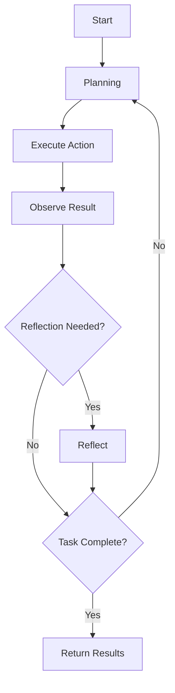

# Reusable Agent Framework

A comprehensive framework for building autonomous AI agents using the **ReAct pattern** (Reasoning + Action + Observation) with reflection capabilities. This framework provides the foundation for creating intelligent agents that can plan, execute actions using tools, and reflect on their progress.

## 🎯 Features

- **Autonomous Execution**: Agents can operate independently using the ReAct pattern
- **Tool System**: Extensible tool registry for adding custom capabilities
- **Reflection & Learning**: Built-in reflection mechanisms for self-improvement
- **Interactive Chat**: Conversational interface for real-time interaction
- **State Management**: Persistent state tracking and history
- **Error Handling**: Robust error recovery and retry mechanisms
- **TypeScript Support**: Full type safety and IntelliSense support

## 🏗️ Architecture

### Core Components

```text
/src/agent/
├── agent.ts          # BaseAgent class with ReAct implementation
├── tool.ts           # Tool abstract class and registry
├── types.ts          # TypeScript interfaces and types
├── planning.ts       # Planning prompt templates and logic
├── reflection.ts     # Reflection prompts and analysis
├── index.ts          # Main exports
└── examples/         # Example implementations and demos
    ├── example-agent.ts
    └── example-tools.ts
```

### Key Classes

- **`BaseAgent`**: Abstract base class implementing the ReAct pattern
- **`Tool`**: Abstract base class for all agent tools
- **`ToolRegistry`**: Manages available tools and their execution
- **Planning & Reflection**: Prompt templates and logic for autonomous reasoning

## 🚀 Quick Start

### 1. Create a Custom Agent

```typescript
import { BaseAgent, Tool, AgentConfig } from '../../src/agent/index.js';

class MyCustomAgent extends BaseAgent {
    constructor(config?: AgentConfig) {
        super('my_task', config);
    }

    protected initializeTools(): void {
        // Register your tools
        this.registerTool(new MyCustomTool());
    }

    protected getTaskDescription(): string {
        return 'Description of what this agent does';
    }

    protected getObjectives(): string[] {
        return [
            'Objective 1',
            'Objective 2',
            'Objective 3'
        ];
    }
}
```

### 2. Create Custom Tools

```typescript
import { Tool, ToolInput } from '../../src/agent/index.js';

class MyCustomTool extends Tool {
    constructor() {
        super('my_tool', 'Description of what this tool does');
    }

    protected async run(input: ToolInput): Promise<any> {
        // Implement your tool logic here
        return { result: 'Tool output' };
    }

    getSchema(): any {
        return {
            name: this.name,
            description: this.description,
            parameters: {
                type: 'object',
                properties: {
                    // Define your tool parameters
                },
                required: []
            }
        };
    }
}
```

### 3. Execute Tasks

```typescript
const agent = new MyCustomAgent();

// Autonomous execution
const result = await agent.executeTask('Solve this problem...');

// Interactive chat
const response = await agent.chat('What can you help me with?');
```

## 📚 Examples

### Text Analysis Agent

```typescript
import { createExampleAgent } from './src/agent/examples/example-agent.js';

const agent = createExampleAgent();

// Analyze text
const result = await agent.analyzeTextWithStats(
    'This framework is amazing for building AI agents!'
);

console.log(result);
```

### Math Problem Solver

```typescript
const agent = createExampleAgent();

// Solve math problems
const result = await agent.solveMathProblem(
    'Calculate 15 + 23, then multiply by 2'
);

console.log(result);
```

## 🔧 Tool Development

### Tool Interface

All tools must extend the `Tool` abstract class:

```typescript
abstract class Tool {
    // Execute the tool with given input
    async execute(input: ToolInput): Promise<ToolResult>
    
    // Implement tool logic (abstract)
    protected abstract run(input: ToolInput): Promise<any>
    
    // Get OpenAI function calling schema (abstract)
    abstract getSchema(): any
    
    // Validate input (optional override)
    protected validate(input: ToolInput): { valid: boolean; error?: string }
}
```

### Tool Result Format

```typescript
interface ToolResult {
    success: boolean;
    data?: any;
    error?: string;
    metadata?: Record<string, any>;
}
```

## 🧠 Agent Behavior

### ReAct Pattern Implementation

1. **Reasoning**: Agent analyzes the current situation and plans next action
2. **Action**: Agent executes a tool with specific input
3. **Observation**: Agent processes the tool result and updates context
4. **Reflection**: Agent evaluates progress and adjusts strategy (optional)

### Execution Flow



## ⚙️ Configuration

### Agent Configuration

```typescript
interface AgentConfig {
    maxSteps?: number;        // Maximum execution steps (default: 50)
    maxRetries?: number;      // Maximum retry attempts (default: 3)
    enableReflection?: boolean; // Enable reflection phase (default: true)
    enableLogging?: boolean;   // Enable console logging (default: true)
    persistState?: boolean;    // Persist state across runs (default: false)
}
```

### Usage Example

```typescript
const agent = new MyAgent({
    maxSteps: 30,
    maxRetries: 2,
    enableReflection: true,
    enableLogging: false
});
```

## 📊 State Management

### Agent State

```typescript
interface AgentState {
    id: string;
    taskType: string;
    currentStep: number;
    history: AgentHistoryEntry[];
    context: Record<string, any>;
    tools: string[];
    status: AgentStatus;
    createdAt: Date;
    updatedAt: Date;
}
```

### History Tracking

The framework automatically tracks:

- Thoughts and reasoning
- Actions taken and tool executions
- Observations and results
- Reflections and insights

## 🛠️ Integration with Project

### Using Existing Services

```typescript
import { OpenAIService } from '../openai.service.js';
import { sendReport } from '../report.js';
import { extractFromTags } from '../utils.js';

// The framework automatically integrates with existing services
// Your custom agents can access these through the base class
```

### Task Implementation

For AI_devs tasks, follow this pattern:

```typescript
// /tasks/s05e01/phone-agent.ts
import { BaseAgent } from '../../src/agent/index.js';
import { sendReport } from '../../src/report.js';

export class PhoneAgent extends BaseAgent {
    // ... implementation

    async completeTask(): Promise<void> {
        const result = await this.executeTask();
        await sendReport('phone', result);
    }
}
```

## 🧪 Testing

### Run the Demo

```bash
cd /Users/marek.szkudelski/cursor/ai-devs-tasks
npm run start --dir=agent-demo  # If demo task is created
```

### Test Individual Components

```typescript
import { ToolRegistry, TextAnalyzerTool } from './src/agent/index.js';

const registry = new ToolRegistry();
registry.register(new TextAnalyzerTool());

const tool = registry.get('text_analyzer');
const result = await tool?.execute({ text: 'Test text' });
console.log(result);
```

## 🎨 Best Practices

### Agent Design

1. **Single Responsibility**: Each agent should have a clear, focused purpose
2. **Tool Composition**: Use multiple specialized tools rather than complex single tools
3. **Error Handling**: Implement robust error handling and recovery
4. **Logging**: Use appropriate logging levels for debugging and monitoring

### Tool Design

1. **Input Validation**: Always validate tool inputs
2. **Error Messages**: Provide clear, actionable error messages
3. **Documentation**: Include comprehensive schemas and descriptions
4. **Testing**: Test tools independently before integration

### Performance

1. **Caching**: Cache expensive operations in tool implementations
2. **Timeout Handling**: Implement timeouts for long-running operations
3. **Resource Management**: Clean up resources in tool destructors
4. **Batch Operations**: Group related operations when possible

## 🔮 Future Enhancements

- **Multi-Agent Coordination**: Framework for multiple agents working together
- **Persistent Memory**: Long-term memory storage and retrieval
- **Learning from Feedback**: Automatic improvement based on success/failure patterns
- **Visual Interface**: Web-based interface for agent monitoring and control
- **Plugin System**: Hot-swappable tool plugins
- **Performance Analytics**: Detailed metrics and performance monitoring

## 📖 Additional Resources

- [ReAct Pattern Paper](https://arxiv.org/abs/2210.03629)
- [OpenAI Function Calling](https://platform.openai.com/docs/guides/function-calling)
- [AI_devs Project Structure](../README.md)

---

*This framework is designed to be the foundation for all autonomous agent implementations in the AI_devs project, providing consistency, reusability, and extensibility across different task types.*
